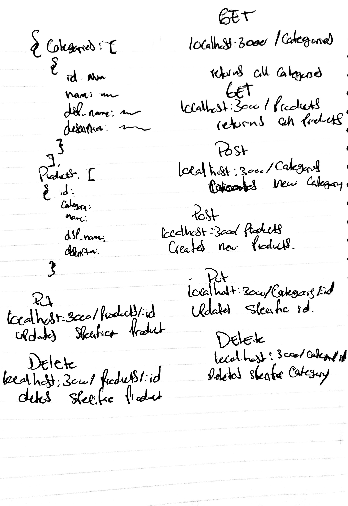

# lab-06

## HTTP and REST

### Author: Antonella Gutierrez

### Links and Resources 

* [submission PR](https://github.com/antonella-401-advanced-javascript/lab-06/pull/1)
* [travis](https://travis-ci.com/antonella-401-advanced-javascript/lab-06)

### Documentation
* [docs](/docs/) (Server assignments)

### Modules
##### Exported Values and Methods

##### Build a working JSON Server
* Implement an API server suitable for a storefront, using json-server
  * Install `json-server` globally
  * Create a new repository called "simple-api"
  * Create a folder called `data` with a `db.json` file
  * Start json-server from within the `simple-api` folder and "watch" your database file
    * `json-server --watch=./data/db.json`
  * Connect a web server

##### Express Server

Create an express server with the following routes and associated model methods:

method | route | model method
---|---|---
`GET` | `/api/things` | Model.find
`GET` | `/api/things/:id` | Model.findById
`POST` | `/api/things` | Model.create
`PUT` | `/api/things/:id` | Model.findByIdAndUpdate
`DELETE` | `/api/things/:id` | Model.findByIdAndRemove

### Setup
#### `.env` requirements
* `PORT` - Port Number

#### Running the app
* `npm start`
* Endpoint: `/`
    * Returns a boolean
* Endpoint: `/docs`
    * Returns JSDoc documentation pages

#### Whiteboard
